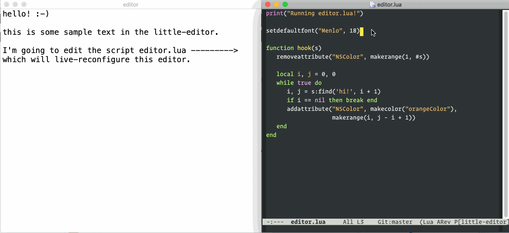

# little-editor

What is the **minimal (small code size, low-dependency) text editor**
for macOS that is extensible? I want a really simple platform that I
understand for experimenting with editor decorations / live
assistance.

I like CodeMirror and Monaco, but I don't want to spin up a Web
browser or Electron instance every time I play with editing. And I
don't want to pull in (and learn details of) giant libraries and a
complicated build system.

And I like having easy access to the underlying operating system and
file system and to different programming languages, external
utilities, and concurrency primitives. And I use macOS, so I don't
need cross-platform abstractions. And I'm experimenting with small
files and small syntax, so it doesn't need to be super-efficient.

## Design



The idea is that [`main.m`](main.m) makes a Cocoa window and draws an
NSTextView, and then as much other text editor behavior as possible
should be scriptable from Lua ([`editor.lua`](editor.lua)) and
instantly live-reload when you save `editor.lua`.

There should be **no configuration** outside `editor.lua`. Instead of
a configuration system to set font size or syntax highlighting or
whatever, you should... reprogram `editor.lua`.

The only external dependency (beyond macOS frameworks) is the Lua
interpreter.

## Install

```
$ git clone https://github.com/osnr/little-editor.git
$ git submodule update --init --recursive
$ make lua
$ make
$ ./editor
```

## Status

Still very early. Need to support drawing arbitrary decorations and
taking click/hover input.
